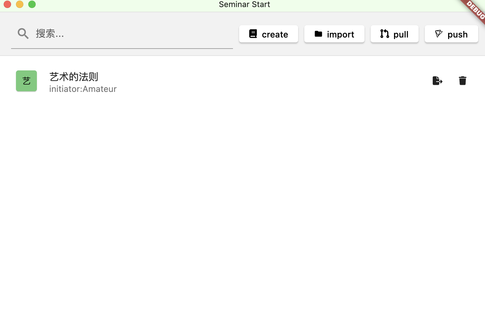
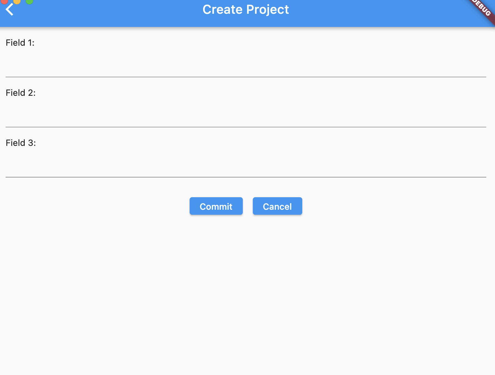
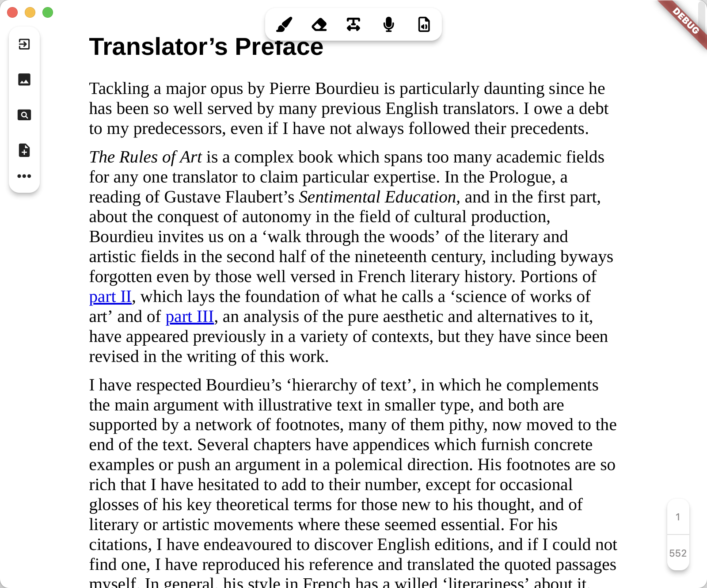

# Reading_League

## January 6, 2024

After much thought, I've decided to release my first project. The code is quite rough, lacking comments, and there are many unnecessary annotations.

### Project Name: Reading_League

### Project Initiator: Amateur

### Reasons for Initiating the Project:

1. I have a passion for philosophy and often engage in discussions and interpretations of original texts with friends. My goal is to organize and package the thoughts, reference literature, related texts, and various content forms like audio, PDF, text, and images generated during reading sessions into a single, easily accessible textual format. Essentially, using a PDF text as the final presentation medium for convenient and quick documentation.

2. There are similar products available, like Notability, but I don't intend to simply replicate them, even though the 'innovation' aspect may seem ambiguous. My aim is not just for solitary reading but to facilitate a group expansion on classical texts, akin to the integration possible with Git.

3. The lack of similar products, I believe, is partly because humanities are undervalued. Few delve into original texts, making such projects less appealing to investors. Additionally, reading is often a very personal activity, and engaging in high-level texts like philosophy can seem pointless due to differing language systems and knowledge backgrounds.

4. Considering this, I decided to initiate this project because technologies like blockchain might give seemingly insignificant individual efforts a potentially meaningful future, marking them as non-fungible. Besides, I genuinely wish to read with a group, as it's challenging and easy to stray when reading alone.

5. Perhaps rationality signifies the 'us' in our hearts. When "we" read together, it might lead to a richer reading experience and intellectual pleasure.

### Project Showcase:

1. A rudimentary entry interface. 'Create' allows starting a new project by importing a book. The issue is that existing third-party PDF viewer libraries are quite slow, offering a poor reading experience. I temporarily solved this by using Python to screenshot each PDF page into images. So, this project is indeed very basic.

   

   'Import' is for importing an existing project, which is a folder structured in a specific format containing .md note files, audio files, PDFs and PDF images, reference literature, and image files.

2. This is the 'Create' interface, providing three elements to define the reading group: possibly the initiator, the original text, and a description.

   

3. This is the reading interface, where you can draw, erase (though the logic isn't clear yet), take notes, insert images, and record and play audio, designed to mimic Notability.
   

4. The project includes a local database for data persistence.

### Project Challenges:

1. The current PDF viewer is not satisfactory. I'm considering using third-party libraries provided by Rust or C for a better PDF reading experience.

2. The Git functionality is not yet integrated. It won't be a full version of Git, and I'm still brainstorming ideas.

3. I'm still developing a web version, mainly a NFT trading marketplace. I haven't figured out how to implement it fully and am currently learning blockchain technology.

4. To assist multilingual readers or translators, such as using machine learning for cross-text reading functionality (automated alignment, implemented backend).

5. This is just a demo. If there's interest, I might push myself further to improve it, as the project is extensive and my demo isn't particularly attractive. It might require more refinement later on.

6. The project scope is indeed vast. Combining learning and writing, I've spent a month and a half on this project and am not quite satisfied with it, but I'm exhausted. I dragged my feet before finally putting it on GitHub.

