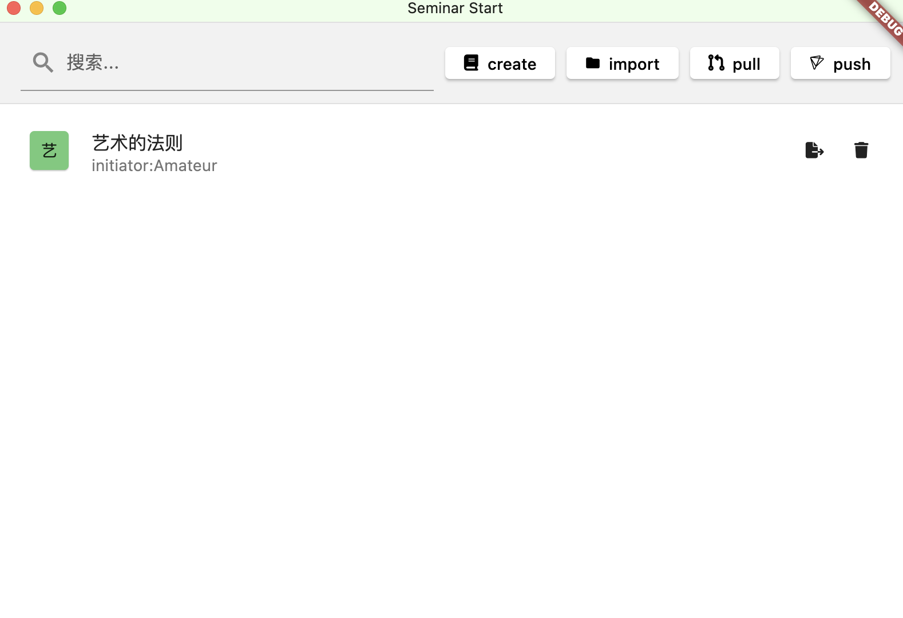
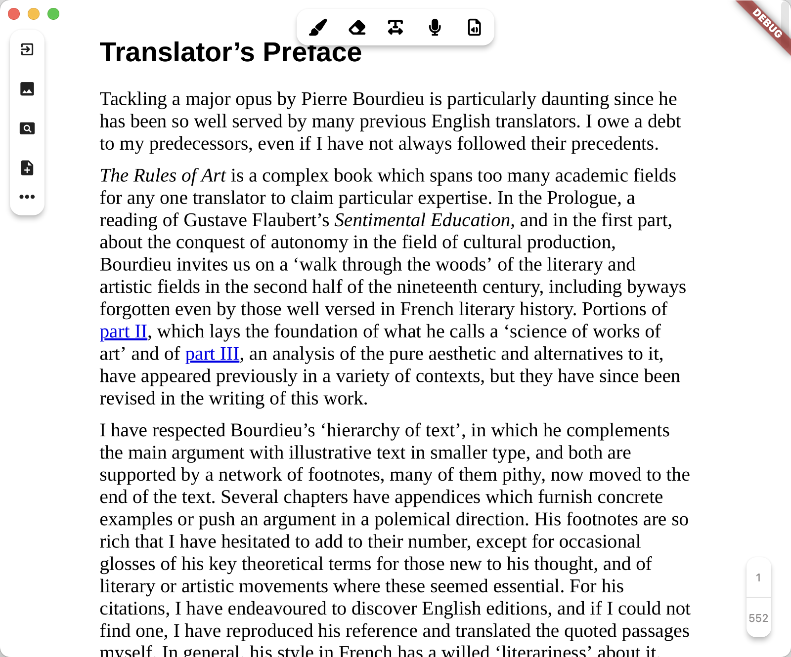

# Reading_League

## 2024年1月6日

思来想去还是把自己的第一个项目发出来了，代码非常烂，没有写什么注释，甚至还有很多不必要的注释。

### 项目名称：Reading_League

### 项目发起者：Amateur

### 项目发起原因：

1.自己本身对哲学保持着一定的热情，会和朋友们一起啃原著，希望能够将读书时产生的想法、参考的文献，关联文本，以及作为机器码载体的音频、pdf、文本、图片等等内容打包进行整理，但是能够轻松的呈现为文本。也就是将某一个pdf文本作为最终呈现的载体，方便快捷的进行记录。

2.当然，现在有一些类似的产品，比如notability等，我并无意于做一些简单的复制，虽然也不知道所谓的创新点是否有意义。我的目标不仅仅是用于一个人阅读时进行的，而是可以实现类似于git的接入，实现在经典原著上的群体扩展。

3.现在没有出现类似产品的原因，私以为是，人文学科确实很不值钱，啃原著的人少之又少，不太受资本青睐。另一方面，阅读可能是一件非常个人的事情，而且在哲学等高难度文本的阅读中，彼此的语言体系、知识背景等等不一致都会使得这件事情仿佛没有意义。

4.考虑到这些，决定还是发起这个项目的原因是：或许像区块链这样的新技术能够为个人可能无意义的努力提供一个未来有意义的可能性，至少努力本身是被标注为non-fungible。此外，自己确实很希望和一群人一起读书，自己读书的确很难坚持也挺容易读偏。

5.或许理性意味着自己心中的我们，当“我们”一起读书的时候，可能就可以有更加丰富的阅读体验与智识愉悦

### 项目展示：

1.一个粗糙的进入界面，create是创建一个新项目，可以导入一本书，但是问题在于，现存的pdf阅览器第三方库似乎都非常的慢，阅读体验很差。于是我强行自己使用python截图pdf形成一个个的image来临时解决阅读体验不好的问题。所以...这个项目真的很粗糙。

import是基于一个现有项目进行导入，现有项目是一个以特定格式展开的文件夹，里面存储了.md笔记文件、音频文件、pdf与pdf图片文件还有引用文献、图片文件。

2.这个就是进入create界面了,里面提供了3个对这个读书会进行界定的东西，可能是发起人，原著，还有description。

3.这个是阅览界面，能够进行涂画，擦除逻辑还没想明白，能够实现记笔记、插入图片，音频录制与播放等功能，设计仿notability。

4.本项目包括本地数据库，实现数据持久化。

### 项目难点：

1.这个pdf阅览器效果不好，目前打算用rust或者c提供的pdf解析器的第三方库，然后实现更快的pdf阅读体验。

2.git功能尚未接入，当然不是完整版的git，目前也没有什么很好的思路。

3.还在开发web端的内容，主要是一个nft交易市场，实现完全没想好怎么做，目前还在学习区块链技术。

4.为多语种阅读选手或者译者提供帮助，比如利用机器学习实现跨文本阅读功能（自动对其，用后端实现）。

5.这只是一个demo。。。。。如果有人感兴趣的话，我应该会再鸡一鸡自己，因为这个项目显然很大，而且我的demo也并没有足够的吸引力，可能需要我后期再去完善。

6.工程量确实很大。。。我连学带写，写了一个半月的项目，目前实在是不太满意，但真的累坏了。最后拖拖拖才放到github上。